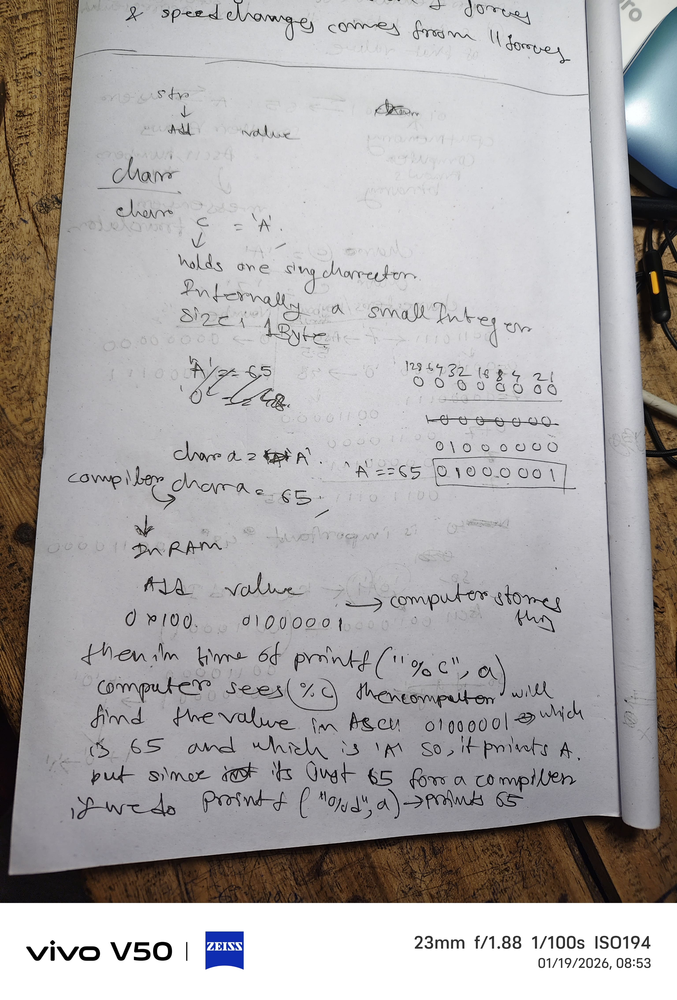
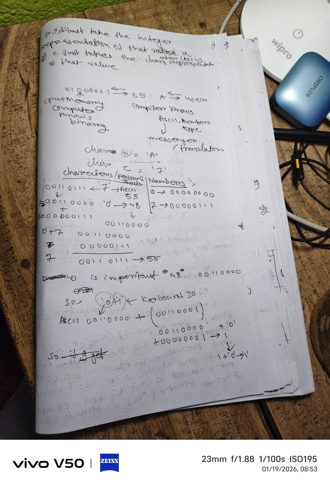

# From `s[i] - '0'` to Binary, ASCII & How Computers Think 🧠⚙️

> **How a single line of C code opened up characters, numbers, binary, ASCII, the compiler, and the CPU.**

---

## 🚀 Motivation

While solving the **CS50 Credit** problem, I encountered this line:

```c
int digit = s[i] - '0';
```

At first, it looked like a trick.

But questioning *why* it works led me into understanding:

* Binary representation
* ASCII encoding
* `char` vs `int`
* Compiler vs CPU roles
* How `printf("%c")` and `printf("%d")` work
* How keyboard input becomes numbers

This repository documents that journey.

---

## ✍️ Handwritten Exploration (Original Notes)

Before structuring anything digitally, I worked through this **by hand**, breaking the idea down to:

* bits
* ASCII tables
* memory
* interpretation vs storage

Below are **photos of my handwritten notes** taken during that process.

> These notes show the raw reasoning that led to the explanations in this repository.

### 📓 Notes – Page 1



### 📓 Notes – Page 2



### 📓 Notes – Page 3


📁 **Folder structure used:**

```
notes/
├── page1.jpg
├── page2.jpg
└── page3.jpg
```

---

## 🧩 The Core Insight

Computers do **not** store characters or numbers.

They store **bits**.

```
01000001
```

That same bit pattern can represent:

| Interpretation   | Meaning |
| ---------------- | ------- |
| Integer (`%d`)   | 65      |
| Character (`%c`) | 'A'     |
| Hex (`%x`)       | 41      |

> **Meaning comes from interpretation, not storage.**

---

## 🔤 Characters vs Numbers (ASCII)

### Numeric values

```
0 → 00000000
7 → 00000111
```

### Character values (ASCII)

```
'0' → 48 → 00110000
'7' → 55 → 00110111
```

When a user types `7`, the program receives `'7'`, not the number `7`.

---

## 🔁 Why `s[i] - '0'` Works

```c
int digit = s[i] - '0';
```

Binary math:

```
'7'  = 00110111  (55)
'0'  = 00110000  (48)
------------------
digit = 00000111  (7)
```

This converts **character digits** into **numeric values**.

---

## 🧠 `char` Is Just a Small Integer

```c
char a = 'A';
```

Stored in memory as:

```
01000001
```

* `%c` → prints `A`
* `%d` → prints `65`

Same bits, different interpretation.

---

## 🛠 Who Knows What?

| Component            | Responsibility                              |
| -------------------- | ------------------------------------------- |
| CPU                  | Executes binary instructions                |
| Memory               | Stores raw bits                             |
| Compiler             | Translates source code, knows ASCII & types |
| C library (`printf`) | Interprets bits for output                  |
| Terminal             | Renders characters                          |
| Human                | Assigns meaning                             |

---

## ⌨️ Input → Output Pipeline

1. Keyboard sends scan code
2. OS converts to ASCII
3. Program receives characters
4. Code converts characters → numbers
5. Output functions interpret bits

---

## 🔒 Key Takeaways

* `'7'` ≠ `7`
* `"7"` ≠ `'7'`
* `char` is a 1-byte integer
* Computers never “see” characters
* Interpretation creates meaning

---

## 📚 Why This Matters

Understanding this removes fear of:

* pointers
* segmentation faults
* parsing logic
* low-level systems

This is where **real computer science thinking begins**.

---

## ✨ Origin

This entire exploration started from deeply questioning:

```c
int digit = s[i] - '0';
```

---

## 🧠 Author’s Note

This repository reflects **my own reasoning process**, starting from handwritten notes and moving to structured documentation.

Tools were used only to **organize and present** ideas already understood.

---

> *“The computer doesn’t know characters.
> It only knows bits.”*
